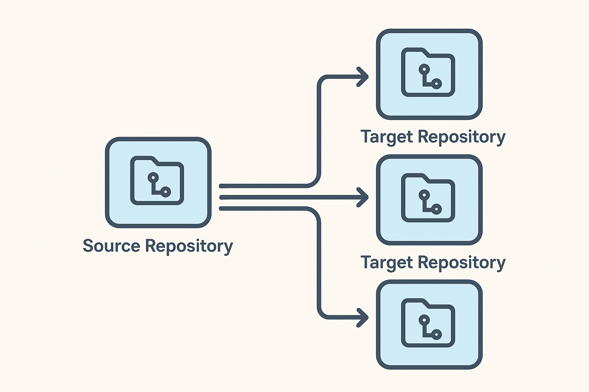

<p align="center">
     
</p>

BoneClone allows you to keep multiple repositories in sync with a skeleton/template repository. It automates the process of cloning, updating, and pushing changes to target repositories based on a defined skeleton structure.

## With BoneClone, you can:

- Maintain a consistent structure across multiple repositories.
- Autodiscover target repositories that match your skeleton/template.
- Allow target repositories to specify which skeletons they accept updates from.
- Open pull requests for updates, optionally requesting reviewers defined within the target repository.
  
## How It Works



* You list the git hosting providers you use (GitHub, GitLab, Azure DevOps) and their credentials in a configuration file.
* You list the files and directories you want to copy from your skeleton/template repository into each target repository.
* You list the files you want excluded from the copy process.
* You specify a file that must exist in each target repository, which BoneClone uses to determine if the repository accepts updates from your skeleton/template.
* BoneClone then reads from each hosting provider's API to discover repositories
* For each target repository, BoneClone:
  - Checks for the identifier file to see if it accepts updates from your skeleton/template.
  - Copies the specified files and directories into the target repository.
  - Opens a pull request with the changes, optionally requesting reviewers defined in the target repository's identifier file.

## Install

`go install go.iain.rocks/boneclone@latest`


## Usage
- Run with explicit config: boneclone -c path/to/config.yaml
- Default config path: --config (alias -c) defaults to .boneclone.yaml in the current directory.
- Run BoneClone from the root of your skeleton template so file include paths resolve correctly.

## Supported hosting platforms
- GitHub
- GitLab
- Azure DevOps

## Configuration

You can reference environment variables in values (e.g., ${GITHUB_TOKEN}). Below are the configuration sections and their fields.

| Field              | Type   | Required | Default | Description |
|--------------------|--------|----------|---------|-------------|
| providers.provider | string | yes      | —       | Hosting provider: github, gitlab, or azure |
| providers.username           | string | no       | —       | HTTP BasicAuth username for clone/push. Some providers ignore it; for GitHub a common value is "x-access-token" |
| providers.org                | string | yes      | —       | GitHub/GitLab: organization/group name. Azure DevOps: organization URL, e.g. https://dev.azure.com/example/ |
| providers.token              | string | yes      | —       | Personal Access Token used for provider API and as the HTTP BasicAuth password for git |
| files.include | [string]    | yes      | —       | Files or directories (relative to your current working directory) to copy into each target repository |
| files.exclude | [string]    | no       | []      | Exact path matches (using your OS path separators) to skip from the discovered include file list |
| identifier.filename | string | yes      | —       | A file that must exist in the target repository; BoneClone reads it to decide eligibility and reviewers |
| identifier.name     | string | yes      | —       | Your skeleton/template name. The target repo's identifier file must list this name under accepts |
| git.name          | string | no       | boneclone               | Commit author name |
| git.email         | string | no       | boneclone@example.org   | Commit author email |
| git.pullRequest   | bool   | no       | true                    | When true, open a PR from an update branch; when false, push directly to targetBranch |
| git. targetBranch | string | no       | main                    | Target/base branch for pushes and pull requests |

### Example config
See `example/multi-providers.yaml`. Minimal example:

```yaml
providers:
  - provider: github
    username: x-access-token
    org: your-org
    token: ${GITHUB_TOKEN}
files:
  include:
    - ci
  exclude:
    - ci/mocks.sh
identifier:
  filename: .boneclone
  name: "Skeleton Template"

git:
  pullRequest: true
  targetBranch: main
```
Environment variables in config values are expanded (e.g., ${GITHUB_TOKEN}).

## Remote repository config (identifier file)
- BoneClone inspects each target repository for the file specified by identifier.filename (e.g., .boneclone).
- That file must be valid YAML with the following fields:
  - `accepts`: [string] — list of skeleton names that are allowed to update this repository.
  - `reviewers`: [string] — optional list of reviewers to request on the pull request.
- A repository is processed only if identifier.name appears in the accepts list.

Example remote identifier file (`.boneclone.yaml`) in target repositories:

```yaml
accepts:
  - Skeleton Template
reviewers:
  - alice
  - bob
```

### Reviewer identity format by provider
- **GitHub:** usernames
- **GitLab:** usernames
- **Azure DevOps:** UniqueName (often email/UPN)

## FAQ

### How does BoneClone discover target repositories?

BoneClone uses the configured provider's API to list repositories in the specified organization/group. It checks each repository for the identifier file (e.g., .boneclone) to determine if it accepts updates from your skeleton/template.

### Can I use BoneClone with private repositories?

Yes, BoneClone supports private repositories. Ensure your Personal Access Token has the necessary permissions to access and modify private repositories.

### Was this built with AI?

The original proof of concept was built by hand and then I used AI to help flesh out features. I thought it would be a good project to use AI on to see how it goes. Since the worse that should be possible by misusing this is you need to do a git revert. 

And since the code was all reviewed by me and code review changes made, it would be roughly the same as if I did it by hand anyways.