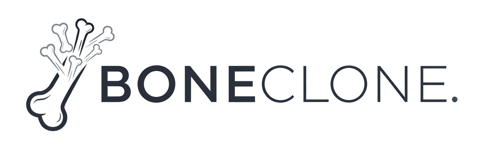

     

**CURRENTLY WORK IN PROGRESS**

A tool to allow you to keep your projects in sync with the skeleton template you created them from.

## Install

To install you can just run the following command

`go install go.iain.rocks/boneclone`

## Usage

`boneclone -c config.yaml`

## Config